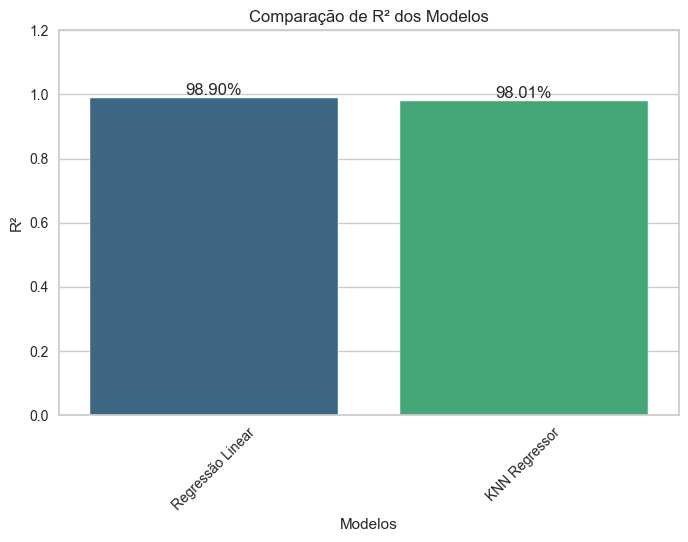
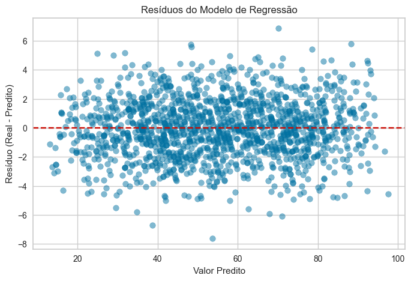
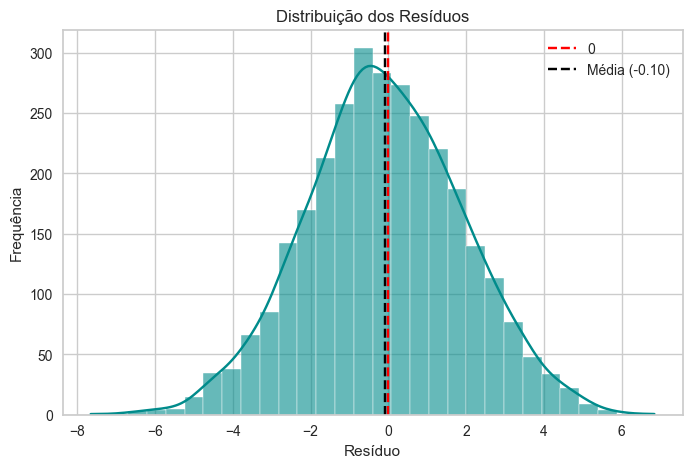

# Requisitos atendidos nesse repositório:


# AutoML

Este projeto implementa um **notebook AutoML** capaz de receber **qualquer base de dados tabular** (CSV), realizar o pré-processamento adequado e testar automaticamente diferentes algoritmos de **Machine Learning**, escolhendo o melhor modelo de acordo com as métricas de avaliação.

---

## Funcionalidades

- Leitura de qualquer dataset `.csv`, identificando automaticamente o delimitador.  
- Tratamento de **dados faltantes** (substituição por moda/mais frequente).  
- Codificação de variáveis categóricas (`LabelEncoder`).  
- Normalização de variáveis numéricas (`StandardScaler`).  
- Teste automático de **7 algoritmos de ML**:
- 2 algoritmos de regressão: 
  - Regressão Linear
  - KNN Regressor
- 5 Algoritmos de classificação:
  - Decision Tree (critério = `"gini"`)  
  - Decision Tree (critério = `"entropy"`)  
  - Naive Bayes  
  - KNN - Classifier
  - XGBoost - Classifier

- **Otimização automática de hiperparâmetros** para cada modelo utilizando `GridSearchCV`.

  
## Seleção do **melhor modelo** com base em métricas de avaliação.

### Classificação: 
- Acurácia

#### Exemplo
- KNN - 92% de acurácia
- Naive Bayes - 87% de acurácia
---
#### Campeão: KNN 🏆
---

### Regressão:
- R²

#### Exemplo
- Regressão Linear - 67% de R²
- KNN Regressor - 87% de R²

---
#### Campeão: KNN Regressor🏆
---

## Estrutura do Projeto

```
├── datasets/          # Datasets testados de exemplo
└── docs/              # Pasta com fotos dos gráficos
├── pickles/           # Pasta com pickles (modelo_<nome>_<base>.pkl)
├── ia-preditiva.ipynb # Notebook principal
├── requirements.txt   # Requisitos para rodar o ambiente.
└── README.md          # Documentação sobre o notebook todo
```

---

### Dependências necessárias
- `jupyter`
- `nbconvert`
- `nbformat`
- `papermill`
- `pandas`
- `numpy`
- `matplotlib`
- `scikit-learn`
- `seaborn`
- `xgboost`
- `yellowbrick`

---

## Exemplo de Saída

### Classificação

- **Comparação de Modelos (Acurácia):**


- **Matriz de Confusão**:  


- **Comparação de Classes (Métricas):**


### Regressão

- **Comparação de Modelos (Regressão):**


- **Resíduos dos Modelos**:  


- **Distribuição dos Resíduos**:



---

Desenvolvido por: [**Rafael Cruz**](https://github.com/RafaelBarretoCruz)
