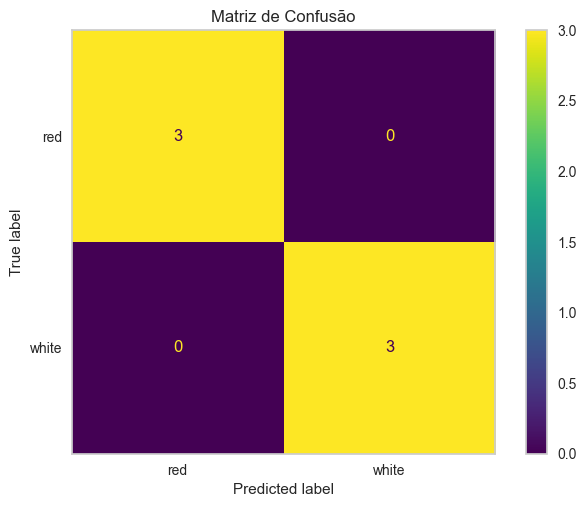
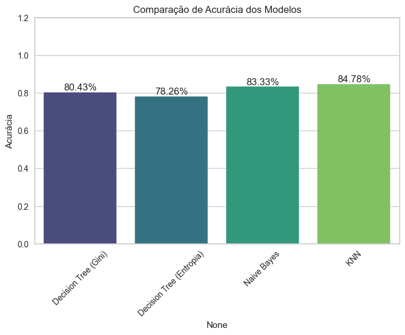
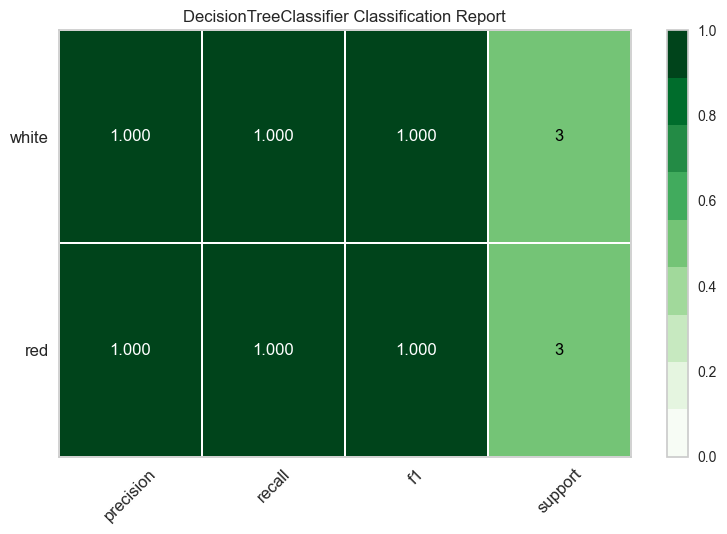

# AutoML

Este projeto implementa um **notebook AutoML** capaz de receber **qualquer base de dados tabular** (CSV), realizar o pré-processamento adequado e testar automaticamente diferentes algoritmos de **Machine Learning**, escolhendo o melhor modelo de acordo com as métricas de avaliação.

---

## Funcionalidades

- Leitura de qualquer dataset `.csv`, identificando automaticamente o delimitador.  
- Tratamento de **dados faltantes** (substituição por moda/mais frequente).  
- Codificação de variáveis categóricas (`LabelEncoder`).  
- Normalização de variáveis numéricas (`StandardScaler`).  
- Teste automático de **6 algoritmos de ML**:
  - Regressão Linear  
  - Decision Tree (critério = `"gini"`)  
  - Decision Tree (critério = `"entropy"`)  
  - Naive Bayes  
  - KNN
  - XGBoost - Classifier

- **Otimização automática de hiperparâmetros** para cada modelo utilizando `GridSearchCV`.

  
## Seleção do **melhor modelo** com base em métricas de avaliação.

### Classificação: 
- Acurácia
### Regressão:
- R²

### >>  O notebook sempre separa 20% para teste de TODOS os modelos! <<

---

## Estrutura do Projeto

```
.
└── docs/              # Pasta com fotos dos gráficos
├── datasets/          # Datasets testados de exemplo
├── ia-preditiva.ipynb # Notebook principal
├── requirements.txt   # Requisitos para rodar o ambiente.
└── README.md          # Este arquivo
```

---

### Dependências necessárias
- `jupyter`
- `nbconvert`
- `nbformat`
- `papermill`
- `pandas`
- `numpy`
- `matplotlib`
- `scikit-learn`
- `seaborn`
- `xgboost`
- `yellowbrick`

---

## Exemplo de Saída

### Classificação
- **Matriz de Confusão**:  



- **Comparação de Modelos (Acurácia):**



- **Comparação de Classes (Métricas):**



---

Desenvolvido por: [**Rafael Cruz**](https://github.com/RafaelBarretoCruz)
